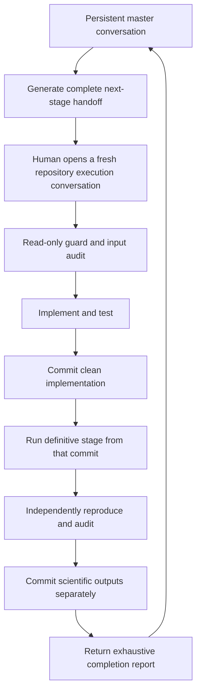
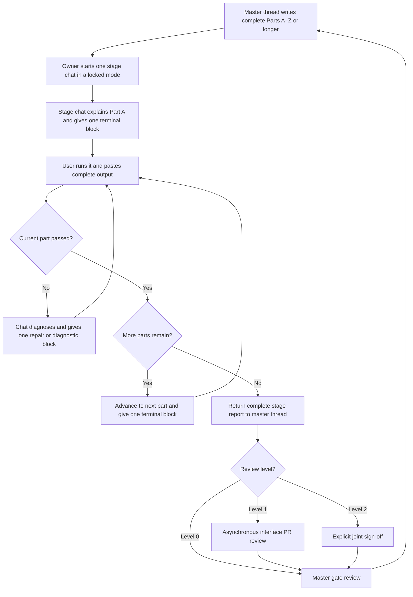

# Project Workflow: Master Thread, Stage Handoffs, and Two-Person Execution

## Purpose

This document explains how the project is actually run from one stage to the
next. It is the operating procedure for the humans, the persistent master GPT
thread, and the separate stage GPT chats.

It does **not** replace the scientific protocol or implementation order:

- `docs/distillation_followup/distillation_experimental_protocol_draft.md`
  defines what the experiment means and what must be frozen.
- `docs/distillation_followup/distillation_implementation_master.md` defines
  the dependency order, deliverables, and acceptance gates.
- The workstream briefs define the technical ownership of each interface.
- This file defines how a stage moves from the plan into reviewed code,
  validated output, and a clean handoff to the next stage.

The predecessor project used this basic pattern successfully: one persistent
master conversation retained the scientific narrative and produced a large,
self-contained handoff for the next stage; a fresh implementation conversation
carried out that stage against the repository in controlled terminal batches;
its detailed completion report returned to the master thread; and the master
decided whether the gate had passed, needed a repair handoff, or was ready for
the next stage.

The supplied Stage 16 handoff and completion report are the clearest surviving
examples of the exact workflow. They show both the strengths of the old system
and what must change now that two people can work in parallel.

## Exact predecessor workflow

The old project had two different kinds of conversation.

### The persistent master conversation

This was the long-running planning and scientific-governance conversation. It
held the whole implementation order, knew which stages were complete, examined
the report from the last execution conversation, and wrote the next handoff.
It was not restarted at every stage.

The human would return to it with a message equivalent to:

```text
Stage 16 is complete. Here is the full report from the implementation
conversation. Check it against the protocol and implementation order, tell me
whether the gate genuinely passed, and prepare the Stage 17 handoff if it did.
```

The master would not merely say “do Stage 17.” It would produce a standalone
prompt containing enough repository state, scientific context, frozen numbers,
validation rules, prohibited work, and return requirements for a new task to
operate without access to the old conversation.

### One fresh execution conversation per stage

The handoff was pasted into a new implementation conversation connected to the
repository. In the Stage 16 example, the prompt began with the exact repository,
package, authoritative files, clean `main` commit, test state, the administrative
outcome of Stage 15, and the statement that Stage 16 was permitted but had not
begun.

The execution conversation then owned the whole stage. For a substantial stage
this included:

1. a read-only repository guard;
2. inspection of prior artifacts and reusable APIs;
3. implementation and focused tests;
4. regression and repository-wide validation;
5. a clean implementation commit;
6. validate-only execution;
7. definitive scientific execution;
8. independent reproduction from the implementation commit;
9. output, manifest, archive, and scientific audit;
10. a separate scientific-output commit;
11. any separately justified administrative lifecycle commit;
12. a detailed end-of-stage report; and
13. an explicit stop before the next stage.

This means “one stage per conversation” did **not** mean “one commit per stage.”
The conversation managed several lifecycle boundaries while remaining inside
one numbered stage.

### Controlled terminal batches

The execution prompt also governed how the stage chat directed the human's
Terminal. The stage chat did not silently operate for a long period and return
with a finished repository. It worked interactively. Before every batch it had
to explain:

- what the batch would do;
- why it mattered;
- whether it was read-only or modifying;
- what output was expected; and
- what counted as pass, warning, or failure.

It then issued **exactly one** fenced terminal block. The human pasted that
block into Terminal, waited for it to finish, and pasted the complete output
back into the stage chat. The chat diagnosed the reported state before giving
the next single block.

One block may contain several related commands when they form one coherent
batch—for example, branch, commit, cleanliness, artifact-presence, and process
checks in the Part A guard. It must not hide several unrelated lifecycle steps
inside one paste.

The block's output must be diagnostic. It should show actual paths, commits,
counts, hashes, test totals, or failing records, and it should label checks as
pass, warning, or failure. A bare `command succeeded` is inadequate when the
output could instead establish why the stage is safe to continue.

The user pastes back stdout and stderr completely, including the end of long
test output. The stage chat does not guess what a truncated run probably did.
If output is too long, the command should write a log and print a focused tail,
summary, exit status, and log path; a later diagnostic block can inspect more.

This one-block/output-return loop made long, high-risk stages auditable and
prevented silent repairs or unexplained reruns.

### Every stage uses Parts A–Z

Every stage handoff must be divided into at least:

```text
Part A
Part B
...
Part Z
```

If the stage needs more divisions, continue with:

```text
Part AA
Part AB
Part AC
...
```

This is mandatory even for a small stage. A smaller stage has shorter parts;
it does not abandon the sequential structure. Every part is completed in
order. The stage chat must not jump from Part C to Part H because later work
looks easy, and it must not begin the next part until the current part's output
has been returned and diagnosed.

A part can take more than one terminal round if its first output exposes a
problem. Each round still follows the exactly-one-block rule. Repairs are
diagnosed and verified inside the current part before advancing.

### Chat mode and Work mode never mix within a stage

Normal execution uses GPT **Chat mode**. The manual one-block/output-return
loop is specifically designed to make Chat mode sufficient for repository work:
the chat reasons about one controlled action, the user runs it locally, and the
real terminal evidence comes back into the conversation.

The persistent master thread also remains an ordinary GPT planning chat. It
produces handoffs and judges returned reports; it is not converted into the
stage's Work-mode execution session.

Work mode is not the default implementation environment. It is used only
deliberately, normally to use remaining Work-mode credits near the end of a
credit period before they reset.

The mode is locked when the stage begins:

- a stage started in Chat mode must remain in Chat mode through its final
  report;
- a stage started in Work mode must remain in Work mode through its final
  report;
- never complete Parts A–M in Chat mode and move Parts N–Z into Work mode;
- never use Work mode for a long run and then return to the Chat-mode stage as
  though it were one continuous audited conversation.

The master handoff records the selected mode near the top. If the selected mode
becomes unavailable, pause the stage at its last verified part. Do not switch
modes merely to keep moving. Resume in the same mode, or formally abandon that
stage attempt and restart it from the clean pre-stage boundary in one mode.

This avoids splitting the audit trail, losing intermediate reasoning, or
letting two conversations make incompatible assumptions inside one stage.

### The end-of-stage report was deliberately exhaustive

The Stage 16 handoff requested 60 specific return items. The resulting report
was not a casual summary: it recorded commits, run IDs, commands, hashes,
scientific inputs, complete result tables, accounting identities, reproduction,
tests, errors and resolutions, limitations, interpretation, and confirmation
that Stage 17 had not started.

The report then became the input to the master conversation. The master could
check the acceptance gate without reconstructing the stage from scattered chat
messages.

### Historical Stage 16 lifecycle

The actual Stage 16 example used:

```text
pre-implementation HEAD:
b781456940a682573c4f9c979129530bffca9033

implementation commit:
f9981012a592aaf62fa192cd427b3d0aeeff3171

scientific-output commit:
160296886018431601a8a3c80884e1a1478e9bf6

administrative lifecycle commit:
9ee88fc68ec164affdcbe29cd312b2e054608f74
```

The implementation commit contained the deterministic Stage 16 machinery. The
definitive run and independent reproduction used that exact implementation.
The scientific-output commit then recorded only the audited outputs. The final
administrative commit advanced the repository boundary from “Stage 16 absent”
to “Stage 16 complete; Stage 17 absent.”

That separation is central to the workflow. It proves which code produced the
results and prevents later source fixes from being mixed into a result commit.

### The old loop in one view



### What changes for this two-person follow-up

The scientific control loop stays the same, but the unit of delegation must be
smaller where the implementation order explicitly permits parallel work.

- Before Barrier 0, the master still advances largely stage by stage.
- After common schemas are merged, the master may produce parallel lane
  handoffs for Alex and Austin.
- Each lane uses its own branch and pull request rather than both people working
  directly on `main`.
- A lane completion report returns to the same master conversation, which
  tracks that package without pretending the whole stage has passed.
- Integration, production, reproduction, and scientific freeze remain explicit
  joint barriers.

So the new pattern is not a replacement for the old one. It is the old
master/handoff/report loop with parallel branches inserted only at declared
barriers.

## The four parts of the system

### 1. The master GPT thread

The master thread is the project coordinator and scientific memory. Keep one
master thread for the life of the study rather than starting a new planning
conversation for every stage.

It is responsible for:

- remembering the research question and frozen distinctions;
- reading the implementation order and current completion state;
- identifying the next unblocked stage or parallel work package;
- producing precise A–Z handoff messages for stage chats;
- checking completion reports against acceptance gates;
- separating implementation, pilot, production, audit, and freeze work;
- recording blockers, amendments, exclusions, and deviations;
- preventing a result seen in one task from silently changing a prospective
  rule in another task.

The master thread is not the source of truth for code state. Git commits,
tracked documents, sealed manifests, and test output are. If the master cannot
inspect a collaborator's clone directly, the collaborator must paste a compact
completion packet back into the thread.

### 2. Stage GPT chats

Historically, each numbered stage was executed in a fresh GPT chat. In the
two-person follow-up, each numbered stage or explicitly parallel lane package is
executed in its own fresh chat against the correct repository and branch. The
chat receives the complete A–Z-or-longer handoff generated by the master thread.

A fresh stage chat is useful because it has one job, a clear stopping point, and less
risk of carrying assumptions from an earlier stage. It must begin by inspecting
the repository rather than assuming that every statement in the handoff still
matches the checkout.

A stage chat is responsible for:

- inspecting the named authority files and current Git state;
- following Parts A–Z, then AA onward where present, strictly in order;
- giving exactly one pasteable terminal block per operational message;
- waiting for the user to paste complete output before issuing the next block;
- diagnosing the returned output and explaining why the check passed or failed;
- implementing only the assigned scope;
- preserving unrelated work and frozen files;
- adding proportionate tests and validation;
- reporting exactly what changed and what remains unresolved;
- leaving a reviewable commit or branch, when the handoff authorizes commits;
- stopping at the stated gate instead of drifting into the next stage.

The predecessor normally kept implementation, definitive execution,
reproduction, and reporting for one stage in the same execution conversation,
but separated them with commits and guards. One stage chat can also receive a
follow-up repair instruction if review finds a small, local problem. A later
stage or substantially different lane package gets a new stage chat and a new
handoff.

### 3. The two human collaborators

Alex and Austin own decisions and repository access. GPT and Codex help execute
the plan; they do not replace human approval at scientific freeze points.

The baseline ownership is:

| Area | Primary owner | Default reviewer when review is needed |
|---|---|---|
| Protocol, predecessor link, teacher registry, common schemas | Alex | Austin |
| Predictive fidelity, discovery adapters, endpoint reducers | Alex | Austin |
| Teacher caches, student trainer, hard/soft eligibility | Austin | Alex |
| Job DAG, resume, isolated outputs, deterministic merge | Austin | Alex |
| Heavy definitive circuit search | Alex's M5 Max | Austin audits manifests |
| Hierarchical aggregation and interpretation | Alex | Austin |
| Numeric freezes, amendments, production roster, analysis freeze | Joint | Joint |

Ownership is by interface, not by experimental condition. Austin does not own
all soft students while Alex owns all hard students. Both conditions must use
the same trainer, schemas, evaluator, and orchestration interfaces.

“Primary owner” does not mean that person works alone or has greater scientific
authority. It means that person:

- runs that stage chat and the corresponding terminal blocks;
- owns the branch and resolves its immediate failures;
- keeps the stage's local outputs and artifact upload under control; and
- returns the end-of-stage report to the master thread.

“Reviewer” does **not** mean the other person must be contacted after every
stage or repeat the entire stage on their laptop. Most stages do not require a
WhatsApp exchange. Review has three levels.

#### Review Level 0 — master-thread gate only

Use for isolated implementation, internal refactors, additional unit tests,
documentation, and routine execution that does not alter a shared interface or
scientific rule.

- The primary owner completes the stage chat and returns its report.
- The master thread checks the acceptance gate.
- The other collaborator need not review or receive a message.

#### Review Level 1 — asynchronous interface review

Use when a stage changes code or records the other person's lane will consume,
such as schemas, trainer/evaluator interfaces, job records, manifests, or merge
logic.

- The owner opens or updates the pull request.
- The reviewer checks the relevant diff, interface tests, and completion
  evidence; they do not rerun the whole stage.
- A routine review should normally take roughly 10–25 minutes.
- GitHub is the durable review record. WhatsApp is optional and only points to
  it when a response is needed soon.

#### Review Level 2 — explicit joint sign-off

Use only for shared barriers and exceptional scientific events:

- Barrier 0 after Stage 4 common identities and schemas;
- Barrier 1 after Stage 5D synthetic hierarchy analysis;
- Barrier 2 after Stage 6E complete endpoint machinery;
- Barrier 3 at Stage 14 final protocol and production-scope freeze;
- Barrier 4 at Stage 19 sealed teacher-seed inventories;
- Barrier 5 at Stage 26 primary analysis freeze;
- any protocol amendment;
- any unexplained cross-machine or reproduction discrepancy; and
- any decision to change the frozen production roster after launch.

These are the points where both people explicitly say “approved.” A sign-off
may be handled in messages and a pull request when straightforward; it does not
automatically require a meeting. Allow roughly 30–60 minutes when the material
is genuinely substantial.

Across the 27-stage core, this means six planned mandatory joint barrier
sign-offs, plus a limited number of ordinary interface reviews. It does **not**
mean 27 formal reviews or 27 WhatsApp requests.

Any weekly meetings suggested in `broad_timeline.md` are optional scheduling
ideas, not workflow requirements. The six barrier approvals above are the
mandatory review points; even those can usually be completed asynchronously.

The person who needs review sends the notification. A useful message is:

```text
Stage 5B is ready: <PR link>. Could you check the shared student-record schema,
hard/soft separation, and failed-attempt accounting? The focused and portable
tests pass. No need to rerun training. Please leave approval or comments on the
PR when you can.
```

Quick coordination can happen on WhatsApp because Alex and Austin already text
regularly. Any durable approval, scientific choice, or correction must still
be copied into the pull request, master thread, or tracked protocol note.

### 4. GitHub and the artifact store

GitHub is the shared record for code, tests, protocols, configurations, small
manifests, issue/PR discussion, and reviewed summaries. Different laptops and
Wi-Fi networks are irrelevant: both collaborators work from the same remote
repository using their own clones.

Large checkpoints, dense output caches, raw mask-evaluation ledgers, and search
archives do not belong in Git. They are sealed, hashed, and transferred through
the project artifact store. Git receives only the small manifest after the
remote object has been uploaded and its hash verified.

Until artifact transfer has been tested on both laptops, distributed production
is not ready even if both collaborators can push code.

## The adapted two-person control loop



The important point is that a numbered stage is never assumed to equal one
commit. In the predecessor it usually did receive one comprehensive prompt,
but that prompt repeatedly separated:

1. implementation of the machinery;
2. validation or technical pilot work;
3. definitive execution;
4. recording and auditing results;
5. a protocol or lifecycle freeze.

For example, the predecessor had distinct commits for implementing Stage 11
calibration, recording its calibration artifacts, freezing the threshold at
0.99, and then recording the freeze commit. Stage 12 likewise accumulated the
foundation, overlap conventions, frozen configuration, artifact writers,
reports, compute projections, controls, runner, stress tests, and definitive
results in reviewable units. That is the model to preserve.

## The stage-by-stage procedure

### Step 0 — Establish the real starting state

Before writing a handoff, the master thread must establish:

- current branch and commit;
- whether the working tree is clean;
- the last accepted stage and gate;
- open pull requests or unmerged collaborator work;
- available inputs and their hashes;
- any unresolved freeze-register items;
- whether the proposed work is technical development, excluded pilot work, or
  definitive endpoint-producing work.

Never issue a stage prompt based only on the stage number remembered from chat.
The repository may contain a partial implementation, a repair, or a newer
freeze that changes the correct next action.

### Step 1 — Choose one bounded stage or lane package

In the predecessor, the master selected the next complete numbered stage. In
this follow-up, it selects either a complete numbered stage or the smallest
explicitly parallel lane package that ends at an objectively checkable gate.
Examples include:

- build and verify the 15-checkpoint teacher registry;
- implement canonical condition IDs and their invalid-case tests;
- implement centred-logit fidelity without running comparative searches;
- implement hard-target eligibility on synthetic or excluded pilot data;
- execute one frozen production shard;
- merge and audit already sealed shard manifests.

Do not combine parallel lane work merely because it shares a stage number. In
particular, definitive execution cannot begin until the protocol/config freeze
has its own clean commit. A comprehensive execution conversation may perform
both lifecycle steps only if the handoff requires a hard stop, clean commit,
and re-verification between them, as the old Stage 16 task did between
implementation and results.

### Step 2 — Generate the handoff message

The master produces a self-contained message that can be pasted into a fresh
stage chat. Every handoff must name the locked execution mode and must contain
Parts A–Z, followed by AA onward when needed. Across those parts it must cover:

1. **Role and objective** — who owns it and the one-sentence outcome.
2. **Repository state** — repository, base branch/commit, working branch, and
   prerequisite gate.
3. **Authority files** — the exact protocol, implementation-order section,
   schemas, configs, or predecessor artifacts that govern the work.
4. **Scope** — concrete implementation and validation requirements.
5. **Scientific constraints** — definitions that must not be reinterpreted.
6. **Allowed inputs** — especially whether prior results or only technical
   fixtures may be inspected.
7. **Out of scope** — tempting adjacent work that the task must not start.
8. **Deliverables** — expected code, tests, manifests, or notes.
9. **Verification** — exact focused checks plus an appropriate broader suite.
10. **Acceptance gate** — an observable condition for completion.
11. **Git closure** — branch/commit expectations and whether pushing is
    authorized.
12. **Return format** — the completion packet that must come back to master.
13. **Sequential interaction rule** — one part at a time, one terminal block
    per operational reply, then wait for complete pasted output.
14. **Diagnostic design** — the values and failure evidence every block must
    print rather than merely returning a success code.
15. **Mode lock** — Chat or Work for the entire stage, with no mid-stage switch.

The handoff should resolve ordinary implementation ambiguity but must not make
up unresolved scientific choices. If a numeric rule is not frozen, the task may
make it configurable and gather explicitly excluded technical evidence; it may
not quietly choose the definitive value.

### Step 3 — Create or update the branch

The solo predecessor worked directly from clean `main`. That is unsafe with two
people. The follow-up uses one branch per bounded work package, for example:

```text
feat/stage-03-teacher-registry
feat/stage-05a-centred-logit-fidelity
feat/stage-05b-teacher-target-cache
fix/stage-05a-batched-reduction
run/stage-15-teacher-seed-2
audit/stage-24-inventory
```

Before beginning:

1. fetch the remote;
2. update from `main`;
3. confirm the intended prerequisite commit is present;
4. confirm no one else is editing the same owned interface;
5. create the stage branch.

Do not share a working branch between laptops and do not force-push a shared
branch. If two packages truly run in parallel, they receive separate branches
and should touch different owned interfaces.

### Step 4 — Run the fresh stage chat

The human opens a fresh GPT chat in the mode declared by the handoff, against
the repository/branch, and pastes the entire handoff without shortening away
its Parts A–Z or its constraints.

The stage chat should then:

1. announce Part A and explain its first diagnostic batch;
2. provide exactly one fenced terminal block;
3. wait while the human runs it and pastes the complete output;
4. diagnose the output, including any warnings or failures;
5. remain in Part A for further one-block rounds until its gate passes;
6. announce Part B and repeat the same loop;
7. continue in order through Part Z and any AA-onward parts;
8. never change between Chat and Work mode inside the stage;
9. finish with the required completion report and explicit next-stage boundary.

The chat must not treat a passing test suite as sufficient if the scientific
contract is wrong. It must also not rewrite a frozen protocol to make new code
pass.

### Step 5 — Owner check before push or merge

The owner checks:

- whether the diff matches the requested scope;
- whether unrelated files or large artifacts were added;
- whether generated outputs are development, definitive, or excluded;
- whether tests genuinely exercise the acceptance gate;
- whether the completion report admits limitations and failures;
- whether the commit message describes the actual lifecycle step.

This check occurs within the stage's later parts using the same one-block
interaction loop. Small stage commits should be pushed regularly. A long
computation should not be the only copy of days of implementation work.

### Step 6 — Apply the declared review level

The master handoff labels the stage as Review Level 0, 1, or 2 using the rules
above. Level 0 does not contact the other collaborator. Levels 1 and 2 should
ask only the checks relevant to the interface or barrier, which may include:

- Does this encode the frozen definition exactly?
- Are condition identities complete and collision-resistant?
- Can a failed attempt or empty recovery be represented without being dropped?
- Are hard and soft conditions kept separate?
- Is teacher seed preserved as the population unit?
- Are exact-evaluation and method-native budgets distinguishable?
- Are artifact paths immutable and hash-verified?
- Could retry, resume, or merge silently double-count work?
- Are tests independent of private predecessor artifacts where they should be?

The author fixes ordinary findings on the same branch and verifies them through
the stage chat. A change to a scientific definition requires Level 2 joint
approval and, where applicable, a dated protocol amendment rather than an
ordinary code-review resolution.

### Step 7 — Return the completion packet to the master thread

After the stage's required review/merge—or earlier if it is blocked—the owner
pastes an evidence-based report into the persistent master thread. It may be
compact for an implementation-only stage, but definitive stages should return
the exhaustive evidence requested by their A–Z-or-longer handoff.

Required fields:

```text
Work package:
Owner:
Status: complete | blocked | needs-review | failed-as-defined
Branch and commit:
Files changed:
What was implemented:
Tests/checks and exact outcome:
Artifacts produced, classification, location, and hashes:
Acceptance gate evidence:
Deviations or unresolved questions:
Suggested next dependency:
```

`Failed-as-defined` is a legitimate scientific or operational result. For
example, a student attempt that fails the frozen eligibility rule is recorded
and counted against the attempt cap; it is not repaired by changing the rule.

### Step 8 — Master gate review

The master compares the completion packet with the implementation order and
the repository state. It chooses exactly one outcome:

- **Accept:** the gate passed; mark the work package complete and prepare the
  next unblocked handoff.
- **Repair:** issue a narrow handoff for a local defect or missing check.
- **Split:** accept the completed portion and create a separate package for
  unfinished work.
- **Escalate:** stop and ask Alex and Austin to resolve a scientific decision,
  interface conflict, or protocol amendment.
- **Record failure:** preserve a frozen failure outcome and continue according
  to the predeclared rule.

The master should state why the gate passed. “The stage chat says it
is done” is not gate evidence.

### Step 9 — Separate production from implementation

When code is ready, the master does not casually say “now run everything.” A
result-producing stage receives either its own execution handoff or an explicit
execution section after a clean implementation-commit gate in the same stage
task. It must contain:

- the exact frozen config and freeze commit;
- an immutable job registry;
- assigned machine and owner for every job;
- input artifact hashes;
- output and scratch roots;
- resume and retry rules;
- resource limits and expected storage;
- progress reporting that avoids comparative endpoint inspection;
- sealing, hashing, upload, and manifest rules;
- the condition that defines job success or failure.

Execution is followed by a separate inventory/audit handoff. Analysis begins
only when completeness and reproduction gates are satisfied.

## Handoff template for the master thread

Every handoff must use an A–Z minimum. The exact scientific content changes by
stage, but this is the default scaffold. Parts may be renamed or subdivided,
and AA onward should be added whenever Z is not enough. Letters are never
silently omitted.

```text
HANDOFF — [work package ID and title]

Owner: [Alex or Austin]
Reviewer: [none / name]
Review level: [0 / 1 / 2]
Execution mode: [Chat / Work — locked for the whole stage]
Objective: [one verifiable outcome]

Stage-chat interaction contract
- Complete Parts A–Z and any AA-onward parts strictly in order.
- In every operational reply, explain the batch and give exactly one fenced
  terminal block.
- The user runs it and pastes the complete output back.
- Diagnose that output before giving another block.
- If a part fails, stay in that part until diagnosed and repaired or formally
  blocked.
- Never switch between Chat and Work mode during this stage.

Part A — Read-only pre-stage guard
[Repository path, branch, expected HEAD, cleanliness, upstream gate, forbidden
later-stage outputs, active-process check, and diagnostic pass/warn/fail rules.]

Part B — Authority and frozen-boundary audit
[Read and verify the protocol, implementation-order section, configs, hashes,
and exact out-of-scope boundary.]

Part C — Input and provenance inventory
[List exact inputs, paths, identities, counts, hashes, and missing-input stop
conditions.]

Part D — Existing-code and reuse inspection
[Find the relevant APIs/tests and prohibit unnecessary parallel machinery.]

Part E — Stage-specific scientific definitions
[Restate estimand, fidelity, eligibility, failure/null semantics, hierarchy,
and permitted language.]

Part F — Stage-specific record and schema contracts
[Required fields, IDs, versions, cross-field constraints, and invalid cases.]

Part G — Determinism and seed contract
[Seed derivation, ordering, numerical tolerance, device, and reproducibility.]

Part H — Implementation slice 1
[First coherent code change and its boundaries.]

Part I — Focused validation of slice 1
[Diagnostic tests that show both success values and failure reasons.]

Part J — Implementation slice 2
[Second coherent change, if small then a deliberate audit/no-op part.]

Part K — Focused validation of slice 2
[Tests and diagnostic output.]

Part L — Failure, empty, retry, and resume semantics
[Forced edge cases and proof they remain explicit.]

Part M — Integration within the stage
[Connect slices through the real shared interface.]

Part N — Focused stage test suite
[Exact test selection and expected totals/invariants.]

Part O — Upstream regression suite
[Earlier stages and shared APIs that must remain unchanged.]

Part P — Repository-wide quality gates
[Portable/full tests as appropriate, Ruff, diff/whitespace, and large-file or
secret audit.]

Part Q — Pre-commit diff and file-inventory audit
[Show exact files, classifications, sizes, and prohibited outputs absent.]

Part R — Clean implementation commit
[Commit message, commit contents, and clean-tree verification. No definitive
outputs in the implementation commit.]

Part S — Validate-only or dry-run gate
[Prove committed machinery can load frozen inputs without producing results.]

Part T — Execution-authority check
[Confirm whether the stage is technical, excluded pilot, definitive, or
reproduction work and whether execution is prospectively authorized.]

Part U — Stage execution
[Exact command, machine, budget, output root, retry rule, expected runtime, and
diagnostic progress. If non-result-producing, verify and record not applicable.]

Part V — Output inventory and accounting identities
[Expected versus actual jobs, records, counts, nulls, failures, and hashes.]

Part W — Scientific/integrity audit
[Model state, hooks, eligibility, exact ledger, hierarchy, and no-silent-drop
checks applicable to the stage.]

Part X — Independent reproduction or cross-check
[Exact reproduction boundary and byte/semantic comparisons. If legitimately
not applicable, prove why rather than omitting the part.]

Part Y — Manifest, archive, and artifact audit
[Deterministic contents, remote upload verification, hashes, and Git policy.]

Part Z — Acceptance gate and next-stage boundary
[Evaluate every acceptance item, verify the next stage remains absent, and
state pass, blocked, or failed-as-defined.]

Part AA — Scientific-output commit, when applicable
[Commit only audited outputs; otherwise record a verified not-applicable part.]

Part AB — Administrative lifecycle commit, when needed
[Advance absence/current-stage assertions separately; otherwise record why no
administrative commit is needed.]

Part AC — End-of-stage report to the master thread
[Return commits, commands, tests, artifacts, hashes, errors/resolutions,
acceptance evidence, limitations, review status, and proof that the next stage
has not begun.]
```

The master should continue with Part AD, AE, and beyond when a stage needs more
scientific subproblems, production shards, reproduction comparisons, or audit
sections. The alphabet is an ordering device, not a reason to compress work.

### Example of one stage-chat turn

The stage chat's first reply for Part A should look like this in substance:

> Part A is a read-only guard. It confirms that Terminal is in the intended
> repository, the stage branch and prerequisite commit are exact, the tree is
> clean, and no later-stage output already exists. Passing means every expected
> value matches and the command ends with `PART_A_RESULT=PASS`. A warning is a
> known harmless environment difference printed as `WARN`. A mismatch, dirty
> tree, or forbidden output is `FAIL`; if that occurs, remain in Part A and
> diagnose it rather than modifying anything.

The same reply then contains exactly one block. The master replaces the example
literals with the stage's real expected values before issuing the handoff:

```bash
set +e
stage_repo="/Users/alexkolesnikov/Projects/circuit-families-distillation"
expected_branch="feat/stage-03-teacher-registry"
expected_head="REPLACE_WITH_EXACT_PREREQUISITE_COMMIT"
stage_fail=0

cd "$stage_repo" || exit 2

actual_branch="$(git branch --show-current)"
actual_head="$(git rev-parse HEAD)"
tree_state="$(git status --porcelain)"

printf 'repository=%s\n' "$(pwd)"
printf 'branch_actual=%s\n' "$actual_branch"
printf 'branch_expected=%s\n' "$expected_branch"
printf 'head_actual=%s\n' "$actual_head"
printf 'head_expected=%s\n' "$expected_head"

if [ "$actual_branch" = "$expected_branch" ]; then
  printf 'branch_check=PASS\n'
else
  printf 'branch_check=FAIL reason=unexpected_branch\n'
  stage_fail=1
fi

if [ "$actual_head" = "$expected_head" ]; then
  printf 'head_check=PASS\n'
else
  printf 'head_check=FAIL reason=prerequisite_commit_mismatch\n'
  stage_fail=1
fi

if [ -z "$tree_state" ]; then
  printf 'working_tree_check=PASS state=clean\n'
else
  printf 'working_tree_check=FAIL state=dirty\n%s\n' "$tree_state"
  stage_fail=1
fi

if find . -path './.git' -prune -o -iname '*stage04*' -print -quit | grep -q .; then
  printf 'later_stage_output_check=FAIL reason=stage04_output_present\n'
  stage_fail=1
else
  printf 'later_stage_output_check=PASS\n'
fi

if [ "$stage_fail" -eq 0 ]; then
  printf 'PART_A_RESULT=PASS\n'
else
  printf 'PART_A_RESULT=FAIL\n'
fi

exit "$stage_fail"
```

The user pastes the complete output back. The next stage-chat reply first
interprets each actual value. If Part A passed, that same reply introduces the
Part B objective and gives Part B's single block. If Part A failed, it stays in
Part A and gives one diagnostic block targeted at the observed failure.

The final non-operational end-of-stage report is the only stage-chat response
that need not give another command: it is produced after the user has returned
the final verification output and it must not start new work.

## Anatomy of the actual Stage 16 handoff

The old Stage 16 prompt is a useful full-scale example. Its A–Z structure can
be understood as follows:

| Prompt section | Purpose |
|---|---|
| Opening and scope | Pin repository, package, authority files, clean HEAD, completed stages, current administrative state, and “Stage 17 has not begun.” |
| Part A | Require the first action to be a compact read-only guard and define pass/warning/failure before any modification. |
| Parts B–C | Freeze the exact model, checkpoint, source family, thresholds, sparsity boundary, overlap cutoff, and Q1–Q4 input partition. |
| Part D | Force reuse of validated Stage 14 transfer machinery and prohibit a second incompatible implementation. |
| Part E | Revalidate every upstream source circuit and stop on any hash, fidelity, sparsity, overlap, or table mismatch. |
| Parts F–M | Define transfer fidelity, profiles, subset discovery, matrices, distance, complete linkage, null semantics, and structural/functional comparison. |
| Parts N–Q | Specify minimal implementation files, output tables, deterministic archive rules, and manifest contents. |
| Parts R–S | State mandatory accounting identities and 68 concrete tests. |
| Parts T–U | Prescribe lifecycle order and separate implementation and scientific-output commits. |
| Parts V–W | Give expected command interfaces and require isolated reproduction from the exact implementation commit. |
| Parts X–Y | Define a 28-item acceptance gate and hard scientific boundaries. |
| Part Z | Define the controlled terminal interaction style and a 60-item return packet. |

This was intentionally redundant. Critical rules appeared in the scientific
definition, the tests, the acceptance gate, and the “do not” boundary. For a
high-risk definitive stage, repetition made omissions harder.

The completion report mirrored that structure. It led with the outcome, then
reported:

- the run ID and three lifecycle commits;
- the frozen analysis and configuration;
- complete input and hash provenance;
- subset identities and source-circuit revalidation;
- scientific outputs and cautious interpretation;
- exact evaluation accounting;
- independent reproduction and byte comparisons;
- manifest/archive integrity;
- committed file inventory;
- repository-wide tests and style gates;
- every issue encountered and how it was resolved;
- limitations, useful follow-ups, final interpretation, and confirmation that
  the next stage remained absent.

For Stage 16, the original and reproduction runs completed 25,899 circuit
evaluations, all nine deterministic comparisons were byte-identical, the full
suite reported 532 passing tests, and the task stopped before Stage 17. Those
facts—not the length or confidence of the prose—were the acceptance evidence.

Every new handoff needs A–Z sections. Detail inside each part remains
proportional to risk: a schema-only stage can complete execution/reproduction
parts with concise, evidenced not-applicable outcomes, whereas a definitive
scientific stage should approach or exceed the Stage 16 specificity for
provenance, boundaries, identities, reproduction, and return evidence.

## Example 1 — Alex receives the teacher-registry handoff

This is the minimum content map the master should expand into the Stage 3
handoff. Exact paths, commits, commands, diagnostics, and test names are filled
from the repository at handoff time. It is still A–Z-plus, even though Stage 3
is smaller than the historical Stage 16.

```text
HANDOFF — Stage 3: select and seal the teacher phase registry

Owner: Alex
Reviewer: Austin
Review level: 1 — shared registry interface only; Austin does not rerun private
teacher selection
Execution mode: Chat — locked for the whole stage
Objective: produce a verified registry of one pre, nearest eligible 50%, and
stable-post teacher checkpoint for each of seeds 0–4, selected separately per
teacher using only the frozen training/test-metric rules.

Part A — Read-only repository, branch, HEAD, cleanliness, process, and Stage 4
absence guard.
Part B — Verify Stage 3 protocol and implementation-order authority.
Part C — Inventory seeds 0–4 metrics, checkpoints, manifests, and hashes.
Part D — Inspect and reuse predecessor phase-selection machinery.
Part E — Restate the per-teacher pre/nearest-50%/stable-post rules and forbid
common-step substitution or new endpoint inspection.
Part F — Define the registry record and unavailable-phase schema.
Part G — Freeze deterministic ordering, hashing, and path representation.
Part H — Implement candidate extraction from training/test metrics only.
Part I — Diagnose candidate extraction for all five seeds.
Part J — Implement independent per-seed phase selection.
Part K — Diagnose the 15 expected selections and all rule margins.
Part L — Force missing, duplicate, ambiguous, and hash-mismatch cases.
Part M — Implement canonical registry serialization.
Part N — Implement the registry verifier.
Part O — Run focused selector/schema/verifier tests.
Part P — Run predecessor-selection regressions and portable full tests.
Part Q — Audit diff, file sizes, private paths, and absence of checkpoints.
Part R — Commit implementation only.
Part S — Run validate-only against private predecessor inputs.
Part T — Confirm this is prospective registry sealing, not endpoint production.
Part U — Generate the canonical registry from the committed implementation.
Part V — Inventory 15 entries or explicit unavailable outcomes and exact hashes.
Part W — Audit selection criteria without viewing circuit/distillation results.
Part X — Independently recompute checkpoint and registry hashes.
Part Y — Verify no private checkpoint or large artifact enters Git.
Part Z — Evaluate the Stage 3 acceptance gate and prove Stage 4 has not begun.
Part AA — Commit the sealed small registry separately if it is generated output.
Part AB — Apply Austin's Level 1 review to schema compatibility only.
Part AC — Return the full Stage 3 report to the master thread.
```

Notice that this handoff permits an honest unavailable outcome. It does not
pressure the stage chat to manufacture 15 entries merely because 15
were planned.

## Example 2 — Parallel handoffs after Barrier 0

After common schemas and identities pass Stage 4, the master may issue two
independent **complete A–Z-or-longer handoffs** at the same time. The following
are scope excerpts only; neither excerpt is a valid standalone stage prompt.

### Alex: Stage 5A

```text
Implement centred-logit predictive fidelity on
feat/stage-05a-centred-logit-fidelity. Work only through the shared sealed-model
and evaluation-ledger schemas. Test self-fidelity, per-input additive-gauge
invariance, deterministic full-domain reduction, batching equivalence,
denominator handling, and representable negative values. Do not calibrate or
freeze the 0.99 threshold and do not run comparative teacher/student searches.
```

### Austin: Stages 5B–5C foundation

```text
Implement the teacher target-cache and shared hard/soft trainer foundation on
feat/stage-05b-targets-trainer. Consume the common Stage 4 identities and
schemas without changing them unilaterally. Hard targets and centred soft
targets must share data ordering and provenance. Use synthetic or explicitly
excluded technical fixtures only. Do not choose the definitive soft tolerance,
optimizer roster, attempt cap, or stopping rule; expose unresolved values in
versioned config. Do not run a definitive student roster.
```

These packages can proceed concurrently because their shared contract was
merged first and their file/interface ownership is separate. If either stage chat
finds the common schema inadequate, it opens a schema-change request; it does
not fork a private record format.

## Example 3 — Completion packet returned to master

```text
Work package: Stage 5A centred-logit predictive fidelity
Owner: Alex
Status: complete
Branch and commit: feat/stage-05a-centred-logit-fidelity @ abc1234
Files changed: src/...; tests/...; configs/...
What was implemented: streaming canonical-order centred-logit evaluator and
versioned metric record; no threshold calibration or production evaluation.
Tests/checks: 18 focused tests passed; full portable suite 413 passed and 270
skipped; lint passed.
Artifacts: one synthetic metric fixture, classified technical/non-scientific,
tracked in tests; no private or endpoint-producing artifacts.
Gate evidence: self-comparison = 1 within frozen numerical tolerance; random
per-input class-constant shifts produced identical aggregate; batched and
unbatched reductions agreed within tolerance.
Deviations: denominator-zero case currently raises the schema-defined error;
no scientific choice made.
Suggested next dependency: Stage 6A intact-mask baseline and endpoint reducer,
after review and merge.
```

The master can assess this report. “Done, tests pass” would not contain enough
information to approve the gate.

## How parallel work is coordinated

Parallel work begins only at an explicit barrier in the implementation order.
For the present project, Barrier 0 is Stage 4: both laptops must exchange and
validate the same synthetic records using the same condition IDs and seed
derivation.

After that barrier:

- Alex can work on fidelity/endpoints/discovery interfaces.
- Austin can work on target caches/training/eligibility/orchestration.
- Each uses a separate branch and pull request.
- Neither changes the shared schema without a small interface PR reviewed by
  the other person.
- The master thread tracks both packages as independently open.
- A downstream integration handoff is issued only when both prerequisite PRs
  are merged.

A useful master-thread status block is:

```text
Barrier 0: passed at <commit>
Alex package: 5A, in review, branch ..., blocked by nothing
Austin package: 5B/5C foundation, implementing, branch ..., blocked by nothing
Next integration package: Stage 7, blocked by both PRs plus Stage 5D
Scientific freezes still open: soft tolerance, attempt cap, optimizer roster
Definitive production authorized: no
```

This prevents “Austin finished his bit” from being confused with “the combined
pipeline is ready.”

## Git and communication rhythm

The workflow is asynchronous by default.

- Pull before beginning a package and before resolving an interface conflict.
- Commit after each passing implementation unit; push at least daily while a
  package is active.
- Open a draft PR early when another package depends on the interface.
- Put durable technical decisions in the PR or tracked docs, not only in text
  messages.
- Use ordinary chat for quick coordination, but update the master thread with a
  completion packet whenever a gate changes state.
- Do not request collaborator review for a declared Level 0 stage.
- For Level 1, the PR is the request; send a WhatsApp pointer only when the
  review is blocking near-term work.
- For Level 2, explicitly request approval and record it durably.
- The reviewer should respond promptly to schema, protocol, and integration
  PRs because these can block both lanes.
- Merge small interface contracts before large implementations that consume
  them.

Regular pushes are not a substitute for artifact upload. Conversely, uploading
a checkpoint is not a substitute for committing its verified manifest.

## Scientific firewall and result visibility

Every numerical run must be classified before it starts:

| Classification | Purpose | May inform a later freeze? | Included in primary results? |
|---|---|---:|---:|
| Unit/synthetic fixture | Test code contracts | No scientific evidence | No |
| Technical integration run | Verify end-to-end mechanics | Only predeclared technical properties | No |
| Excluded development pilot | Estimate feasibility and set permitted frozen values | Yes, only as allowed by protocol | No |
| Definitive production | Produce frozen endpoints | No retroactive rule changes | Yes |
| Reproduction | Verify sealed production outputs | No | Audit only |

If a development task accidentally exposes a comparative endpoint, record it
in the excluded-output register. Do not pretend it was unseen and do not use it
to optimize the primary protocol.

## Repairs, failures, and amendments

### Ordinary code defect

If the stage chat is still active, remain in the current part: diagnose the
defect with one terminal block at a time, fix it, add a regression test, and
verify it before advancing. If the defect is found after the stage has closed,
the master emits a separate A–Z-or-longer repair handoff. Update every artifact
whose content is invalidated.

### Failed computational job

Apply the frozen retry/resume rule. Do not silently restart with a different
seed, budget, tolerance, or optimizer. Preserve failure records when the
protocol counts attempts.

### Scientific definition needs to change

Stop affected work. Alex and Austin jointly decide whether the change is:

- a clarification consistent with the frozen estimand;
- a prospective amendment made before affected results are visible; or
- an exploratory deviation that cannot replace the primary analysis.

Record the decision, reason, date, affected artifacts, and approval before
issuing a new handoff.

### A gate cannot be passed

Do not repeatedly ask a coding task to force success. Return an evidence-based
blocked or failed-as-defined packet. The master follows the contingency already
written in the implementation order or escalates the missing decision.

## What the master thread should not do

- It should not hand out later work merely to keep both people busy when a
  shared barrier has not passed.
- It should not let Austin create a parallel schema because Alex's PR is late.
- It should not ask Austin's weak laptop to run definitive circuit search by
  default merely because Austin owns orchestration.
- It should not put checkpoints, raw ledgers, credentials, or large archives
  into GitHub.
- It should not interpret student initialization or circuit repetitions as
  independent population replicates.
- It should not pool hard and soft students.
- It should not call endpoint 1 “the minimum circuit size” or endpoint 2 the
  true number of circuits.
- It should not move from a technical pilot to production without a committed
  protocol/config freeze.
- It should not close a stage without commit, test, artifact, and gate evidence.
- It should not issue a stage handoff shorter than Parts A–Z.
- It should not let a stage chat jump between parts or emit several terminal
  blocks in one operational message.
- It should not advance when the user has not pasted back complete output.
- It should not mix Chat and Work mode inside one stage.

## Starting the present project with this workflow

The clean collaboration repository exists, and Stage 1 now implements the
follow-up namespace, predecessor-link machinery, collision protection, and
prior-results visibility declaration. Stage 1 must pass its master-thread gate
before any later stage begins.

The next master-thread sequence is:

1. **Review and gate Stage 1.** Confirm predecessor preservation, namespace
   safety, the canonical predecessor link, and the Stage 1 completion report.
2. **If Stage 1 passes, issue Stage 2: freeze the scientific skeleton.** Stage 2
   must complete and pass its own gate before the teacher registry is selected.
3. **Only after Stage 2 passes, issue the Stage 3 teacher-registry handoff to
   Alex.** That work depends on the private predecessor metrics and checkpoints
   already on Alex's machine.
4. **In parallel only where the implementation order explicitly permits it,
   let Austin perform non-authoritative environment/interface inspection
   without inventing shared schemas or beginning blocked stages.**
5. **Complete and jointly review Stage 4 common identities and schemas when its
   dependencies are satisfied.** This is Barrier 0.
6. **Issue parallel implementation handoffs:** Alex receives Stage 5A and
   endpoint foundations; Austin receives target-cache, trainer, eligibility,
   and orchestration foundations.
7. **Rejoin at the Stage 7 integration gate.** Run only synthetic and excluded
   technical fixtures.
8. **Use pilot evidence to resolve the permitted numeric freeze register.**
9. **Commit and tag the protocol/config freeze before generating the definitive
   job roster.**
10. **Issue separate production handoffs by immutable job registry.** Heavy
   circuit work runs on Alex's machine; Austin owns the related code and
   manifest flow without being required to execute the heavy search.

## Minimal checklist for every handoff

Before the master sends it:

- [ ] Prerequisite gate and current commit are known.
- [ ] One primary owner is named.
- [ ] Review Level 0, 1, or 2 is declared; a reviewer is named only for Levels
      1–2.
- [ ] Chat or Work mode is selected and locked for the complete stage.
- [ ] Parts A–Z are all present, with AA onward where needed.
- [ ] The one-block/output-return interaction rule is explicit.
- [ ] Every planned block has useful diagnostic output and pass/warn/fail rules.
- [ ] Scope ends at one observable acceptance gate.
- [ ] Authority files and frozen definitions are named.
- [ ] Result visibility and run classification are explicit.
- [ ] Out-of-scope work is explicit.
- [ ] Tests, artifacts, and Git closure are specified.
- [ ] Completion-packet format is included.

Before the master accepts it:

- [ ] The diff/commit exists and matches the reported scope.
- [ ] Required checks passed with exact outcomes recorded.
- [ ] Large/private artifacts and secrets are absent from Git.
- [ ] Generated artifacts are classified, sealed, and hashed as required.
- [ ] The declared review level was satisfied.
- [ ] The implementation-order acceptance gate is actually satisfied.
- [ ] The next handoff does not cross an unresolved barrier.
- [ ] All parts were completed in order in one locked mode.

This is the workflow to keep stable. Individual stage prompts will change, but
the control loop—master A–Z handoff, one-block terminal interaction, complete
output return, evidence-based gate review, then next handoff—should not.
